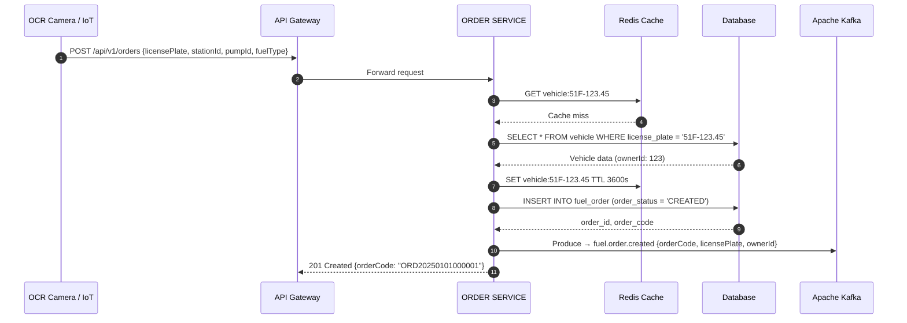
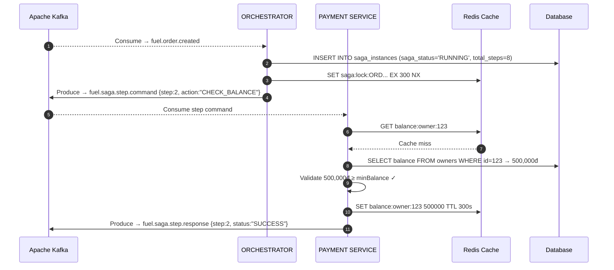
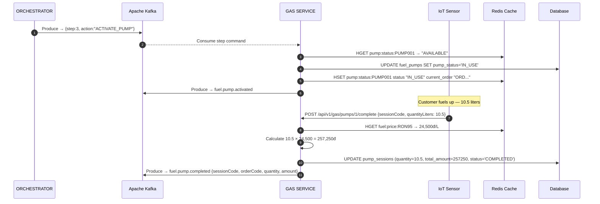
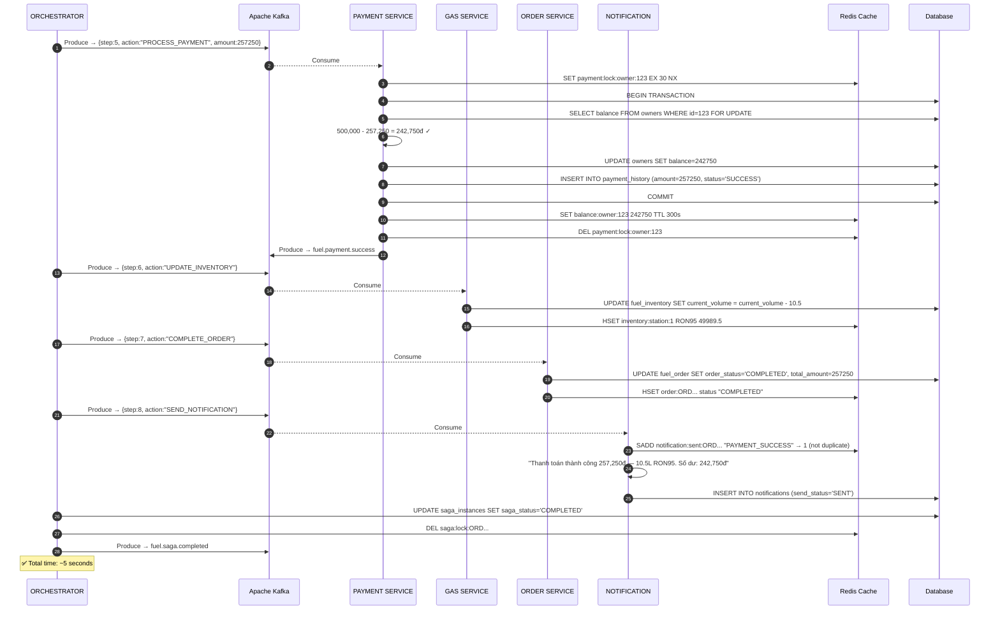
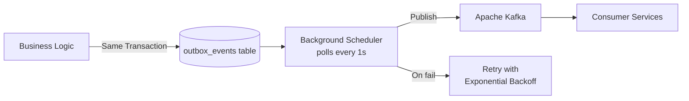
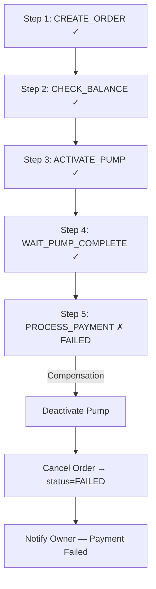
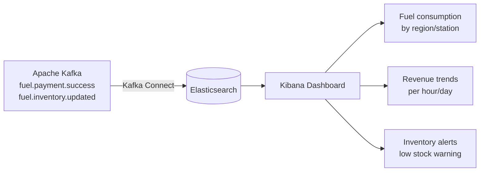
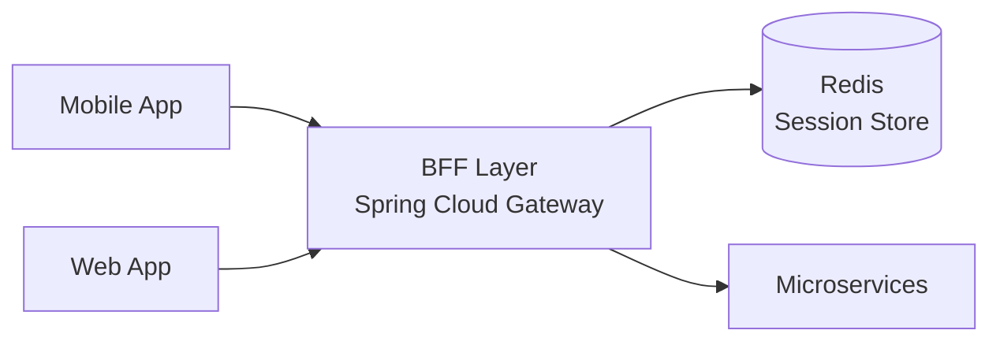
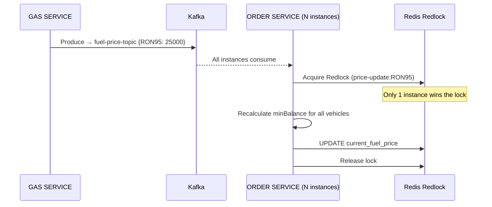

# ⛽ Fuel Payment System

> A high-performance, microservices-based fuel payment platform designed for scalability, real-time pricing synchronization, and guaranteed transactional integrity — built for the Vietnamese energy sector.

---

## 📦 Microservices Overview

| Service | Responsibility |
|---|---|
| `order-service` | Owner/Vehicle registration, balance management, fuel order lifecycle |
| `gas-service` | Fuel pump control, real-time pricing, inventory tracking |
| `payment-service` | Balance deduction, transaction records, payment history |
| `orchestrator-service` | SAGA coordination across all services |
| `attention-service` | Notifications (SMS, push) to owners |

---

## 🚀 Core Flow — SAGA Orchestration Pattern

The entire fuel purchase lifecycle is managed by a **SAGA Orchestrator** coordinating 8 steps across all services via Kafka. Below are the key phases:

### Phase 1 — Order Creation



### Phase 2–3 — SAGA Init & Balance Check



### Phase 4–5 — Pump Activation & Fueling



### Phase 6–10 — Payment, Inventory, Completion & Notification



---

## ⚡ Redis — Full Capability Map

Redis is used across **5 distinct patterns** in this system:

### 1. Application Cache (L1 Distributed Cache)

| Key Pattern | Value | TTL | Purpose |
|---|---|---|---|
| `vehicle:{licensePlate}` | Vehicle JSON | 3600s | Avoid DB lookup on every order |
| `balance:owner:{id}` | Long (VNĐ) | 300s | O(1) balance reads in payment checks |
| `order:{orderCode}` | Order status | 1800s | Fast status lookups |

### 2. JPA Level 2 (L2) Cache — Master Data

Redis acts as the **shared Hibernate L2 cache** for rarely-changing master data:

- **`VehicleModel`** — all running instances share a single cached copy
- Eliminates N+1 query problems for vehicle-model joins
- Automatic invalidation when admin updates model data
- Configured via `spring-boot-starter-data-redis` + Hibernate RegionFactory

### 3. Distributed Locking (Redlock)

| Lock Key | Held By | TTL | Purpose |
|---|---|---|---|
| `saga:lock:{orderCode}` | Orchestrator | 300s | Prevent duplicate SAGA execution |
| `payment:lock:owner:{id}` | Payment Service | 30s | Prevent race condition on balance deduction |
| `pump:lock:{pumpId}` | Gas Service | 60s | Prevent double-activation of same pump |

> **Pattern:** `SET key value EX {ttl} NX` — atomic acquire. Released with `DEL` after work completes.

### 4. Real-Time State (Hash Maps)

```
HSET pump:status:PUMP001
    status       "IN_USE"
    current_order "ORD20250101000001"
    activated_at  "2025-01-01T10:00:00Z"

HGET fuel:price:RON95 → 24500
HGET inventory:station:1 RON95 → 49989.5
```

### 5. Idempotency Guard & Rate Limiting

- `SADD notification:sent:{orderCode} "PAYMENT_SUCCESS"` — prevents duplicate SMS/push
- Sliding window rate limiter: `ZADD + ZCOUNT` on `rate_limit:ip:{ip}` to throttle API abuse
- Future: `INCR + EXPIRE` counter for request-per-second limits per endpoint

---

## 📡 Kafka — Full Capability Map

### Topic Registry

| Topic | Producer | Consumer | Payload |
|---|---|---|---|
| `fuel.order.created` | Order Service | Orchestrator | `{orderCode, licensePlate, ownerId, fuelType}` |
| `fuel.saga.step.command` | Orchestrator | Payment / Gas / Order / Notif | `{step, action, sagaId, payload}` |
| `fuel.saga.step.response` | All services | Orchestrator | `{step, sagaId, status, data}` |
| `fuel.pump.activated` | Gas Service | Notification | `{pumpId, sessionCode}` |
| `fuel.pump.completed` | Gas Service | Orchestrator | `{sessionCode, quantity, amount}` |
| `fuel.payment.success` | Payment Service | Notification / Analytics | `{transactionCode, amount, newBalance}` |
| `fuel.inventory.updated` | Gas Service | Analytics / Dashboard | `{stationId, fuelType, newVolume}` |
| `fuel.saga.completed` | Orchestrator | Audit / Analytics | `{sagaId, orderCode, durationMs}` |
| `fuel-price-topic` | Gas Service | Order Service | `PriceChangedEvent {fuelType, newPrice}` |

### Reliability — Outbox Pattern



> **Guarantee:** Events are never lost even if the service crashes between DB write and Kafka publish. Achieves **At-Least-Once Delivery**.

### SAGA Error Compensation



---

## 🛠️ Performance & Concurrency

### Locking Strategy

| Resource | Lock Type | Reason |
|---|---|---|
| `Owner.balance` | **Pessimistic** (`SELECT ... FOR UPDATE`) | Prevents over-spending in concurrent pumping sessions |
| `VehicleModel` | **Optimistic** (`@Version`) | Low-conflict master data; avoids lock overhead |
| `pump activation` | **Redis Distributed Lock** | Cross-service coordination, no shared DB |

### Async Processing

- **`CompletableFuture` + `TaskExecutor`** — Notification sending (SMS, push) runs in parallel without blocking the payment response.
- **Scheduled polling** — Outbox worker uses `@Scheduled(fixedDelay = 1000)` to flush pending events.
- **HikariCP tuning** — Connection pool configured for sustained high concurrency during peak hours.

---

## 📈 Extension Technologies

### 1. ELK Stack — Real-Time Analytics



**Use Case:** Operations team monitors nationwide fuel consumption trends in real time without impacting the transactional database.

### 2. BFF + Redis Session — Multi-Platform UX



- Redis stores user session tokens — all BFF instances share the same session state.
- BFF aggregates multiple service calls into a single optimized API response per client type.

### 3. IoT Integration — Pump Session Management

| Redis Feature | Use Case |
|---|---|
| `HSET pump:status:{id}` | Real-time pump state (AVAILABLE / IN_USE / ERROR) |
| `BITSET pumping:{date}:{hour}` | HyperLogLog count of unique active pumps per hour |
| `TTL` on session locks | Auto-release stuck sessions after timeout |

**Scale target:** Support millions of concurrent `pumping_session` events across thousands of stations.

### 4. Redis Redlock — Zero-Downtime Price Updates

When gas prices change nationally, `minBalance` must be recalculated for all registered vehicles:



### 5. Testcontainers — Integration Testing

```java
@Testcontainers
class FuelOrderIntegrationTest {
    @Container static MySQLContainer<?> mysql = new MySQLContainer<>("mysql:8");
    @Container static GenericContainer<?> redis = new GenericContainer<>("redis:7");
    @Container static KafkaContainer kafka = new KafkaContainer(DockerImageName.parse("confluentinc/cp-kafka:7"));
}
```

Full integration tests run against real containers — no mocking of infrastructure.

### 6. Observability Stack

| Tool | Role |
|---|---|
| **Prometheus + Grafana** | JVM metrics, Kafka consumer lag, Redis hit rate |
| **Spring Actuator** | Health check endpoints for orchestrator SAGA status |
| **Distributed Tracing (Zipkin/Jaeger)** | End-to-end trace per `orderCode` across all 5 services |

---

## 🏗️ Infrastructure

```yaml
# docker-compose services
services:
  mysql:        image: mysql:8
  redis:        image: redis:7-alpine  (with AOF persistence)
  kafka:        image: confluentinc/cp-kafka:7
  zookeeper:    image: confluentinc/cp-zookeeper:7
```

---

## 🗺️ Development Roadmap

| Phase | Weeks | Focus |
|---|---|---|
| **1 — Core Records** | 1–3 | Owner, Vehicle, VehicleModel entities & validation |
| **2 — Real-Time State** | 4–6 | Redis caching, price sync, `minBalance` calculation |
| **3 — Event-Driven** | 7–9 | Kafka producers/consumers, Outbox pattern |
| **4 — High-Concurrency** | 10–12 | Locking, pump sessions, async notifications |
| **5 — Production** | 13–15 | Integration tests, rate limiting, deployment |

---

> [!NOTE]
> This project is a demonstration of backend engineering excellence — combining **SAGA orchestration**, **distributed caching**, **event-driven architecture**, and **concurrency control** in the Vietnamese energy sector.
